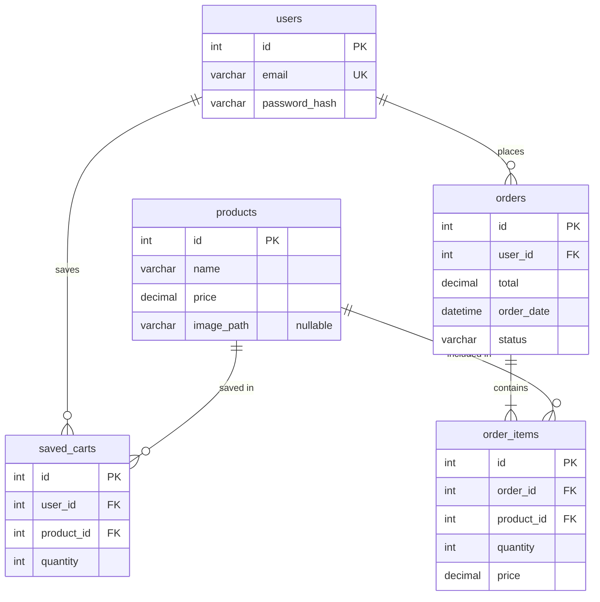

# Entity Relationship Diagram

## Notes

- `saved_carts` is a temporary persistence table: it stores a user's cart between sessions (populated on logout/timeout, cleared on login).
- `order_items.price` stores the product price **at the time of purchase** — not the current price — so historical order totals remain accurate.
- `orders.status` defaults to `'completed'` (no payment gateway in this project).
- `image_path` is nullable so products without an image still work.
