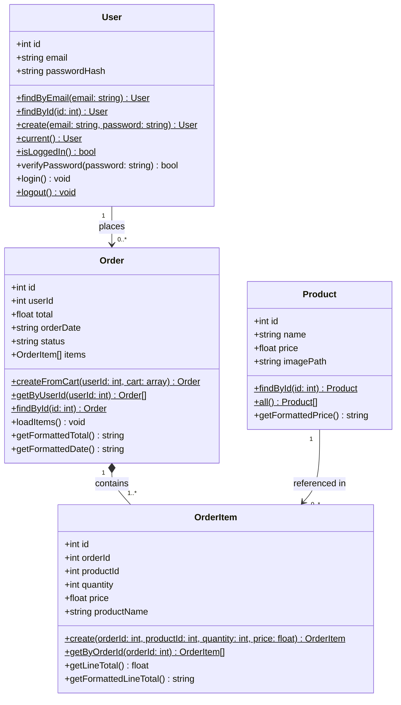

# UML Class Diagram

> **Legend:**
> - `User` — already refactored to OOP
> - `Product`, `Order`, `OrderItem`

## Notes

- `$` after a method return type denotes a **static method** (called on the class, not on an instance).
- Static factory methods (`findById`, `all`, `create`, `current`, `isLoggedIn`) replace raw SQL scattered across the codebase.
- `Order` holds an `items` array of `OrderItem` objects, populated by `loadItems()`.
- `User` has no direct association to `Product` — the cart is managed via session and the `saved_carts` table (handled in the auth controller), not as a class relationship.
